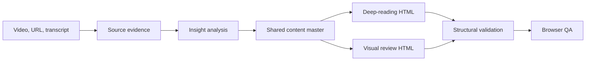

<div align="center">
  

# Video Insight Studio

**Understand long or foreign-language videos through source-grounded analysis, a multilingual deep-reading HTML, and a visual review HTML.**

[简体中文](README.zh-CN.md) · [Live demo](https://tuyaya194-png.github.io/video-insight-studio/) · [Quick start](#quick-start) · [Example](#example) · [How it works](#how-it-works)


</div>

## Why this exists

Language and duration keep many people from useful video content: they may not understand the source language or have time to watch the full recording. Fast bullet summaries help, but often lose the argument, examples, and boundaries that make the ideas trustworthy.

Video Insight Studio treats the work as one complete chain:

```text
video / URL / transcript
        ↓
argument mapping + practical relevance analysis
        ↓
one shared content master
        ↓
deep-reading HTML  +  visual review HTML
        ↓
structural validation and browser QA
```

The two HTML versions share the same claims and page order, but serve different contexts.

| Output | Designed for | What the reader gets |
| --- | --- | --- |
| Deep-reading HTML | Full understanding, saving, search, and repeated review | Explanations, examples, boundaries, and actions in Chinese, English, or bilingual mode |
| Visual review HTML | Fast scanning, structure recall, and later review | One core claim plus one clear visual relationship per page |

## Supported inputs

To prevent post-install surprises, the repository only labels verified entry paths as supported.

| Input | Status | Notes |
| --- | --- | --- |
| Public YouTube videos with accessible captions | Verified | Manual and automatic captions are supported; private, region-restricted, or caption-disabled videos are not guaranteed |
| `.srt`, `.vtt`, or `.txt` subtitles and transcripts | Verified | The most stable platform-independent path |
| Pasted interview, podcast, or video text | Verified | Goes directly into analysis and dual-HTML generation |
| Local video or audio | Conditional | Requires a working speech-to-text tool in the current environment |
| Other platform URLs | Best effort, not promised | Availability is checked first; when blocked, the skill requests subtitles, a transcript, or a local file immediately |

## Highlights

- **Source-grounded analysis** — separates the speaker's claims, examples, and the analyst's interpretation.
- **Language-friendly output** — choose Chinese, English, or paired bilingual pages for the deep-reading version.
- **Long-video friendly** — scan the visual structure first, then open only the explanations you need.
- **Practical value for ordinary people** — translates abstract ideas into implications for work, learning, time, income, risk, and a testable next step, while labeling what is an application-level inference rather than the speaker's own advice.
- **More than bullet points** — separates source claims, examples, and interpretation, then surfaces misunderstandings and boundaries.
- **One source, two outputs** — prevents the deep-reading and visual-review versions from drifting apart.
- **Constrained visual grammar** — uses a small system of flow, comparison, convergence, layers, loops, and divides.
- **Offline, single-file HTML** — the result remains searchable and reopenable without a temporary local server or PowerPoint.
- **Built-in QA** — validates scene counts, playback structure, offline dependencies, visual-system markers, and preview readiness.
- **Local-first workflow** — the bundled scripts do not upload source material or generated files.
- **Copyright-aware by design** — preserves source links and creates analysis and paraphrase instead of reproducing full transcripts or source media.
- **Availability before commitment** — checks the page and transcript first, then fails early with a clear fallback instead of wasting the user's time.

## Quick start

### Already installed? Start with one line

```text
Use $video-to-insight-html on this video: <URL>
```

That is enough to begin. Unless you say otherwise, the skill will:

- use your conversation language for the deep-reading version;
- focus on the core argument and practical relevance for ordinary people;
- create both the deep-reading and visual-review HTML versions;
- check source and caption availability before committing to the full workflow.

You can optionally add a preference such as `bilingual`, `focus on career decisions`, or `deep-reading HTML only`. If the source cannot be read, the skill will immediately ask for subtitles, a transcript, or a local file instead of making you troubleshoot the platform.

### Install with GitHub CLI

```bash
gh skill install tuyaya194-png/video-insight-studio video-to-insight-html \
  --agent codex \
  --scope user
```

### Install from Codex

Ask Codex:

```text
$skill-installer install https://github.com/tuyaya194-png/video-insight-studio/tree/main/skills/video-to-insight-html
```

Restart Codex after installation, then invoke the skill explicitly:

```text
Use $video-to-insight-html on this video: <URL>
```

Optional customized prompt:

```text
Use $video-to-insight-html on this video. Use bilingual output and focus on career decisions: <URL>
```

## What it produces

```text
<topic>_视频观点双版HTML_<date>/
├── 01_观点分析/
│   └── 观点分析.md
├── 02_文字精读版/
│   └── index.html
├── 03_图形速览版/
│   └── index.html
└── project.json
```

Initialize the output structure directly:

```bash
python3 skills/video-to-insight-html/scripts/create_project.py \
  --name "Your topic" \
  --source-url "https://example.com/video" \
  --language bilingual \
  --output-root ./output
```

Validate both versions:

```bash
python3 skills/video-to-insight-html/scripts/validate_project.py \
  --text-dir ./output/<project>/02_文字精读版 \
  --presentation-dir ./output/<project>/03_图形速览版
```

Start both local previews:

```bash
python3 skills/video-to-insight-html/scripts/serve_previews.py \
  --text-dir ./output/<project>/02_文字精读版 \
  --presentation-dir ./output/<project>/03_图形速览版
```

## Example

The repository includes a 20-page dual-output example based on a public talk about becoming an AI-augmented professional:

- [Example context and source](examples/ai-augmented-person/README.md)
- [Chinese viewpoint-analysis manuscript](examples/ai-augmented-person/analysis.zh-CN.md)
- [Deep-reading HTML](examples/ai-augmented-person/text-version/index.html)
- [Visual review HTML](examples/ai-augmented-person/presentation-version/index.html)

| 01 Source video | 02 Viewpoint analysis | 03 Deep-reading HTML | 04 Visual review HTML |
| --- | --- | --- | --- |
|  |  |  |  |

The four frames show one source becoming a reviewable analysis manuscript and then two HTML reading experiences generated from the same content master.

## How it works



The skill contains:

```text
skills/video-to-insight-html/
├── SKILL.md
├── agents/openai.yaml
├── references/
│   ├── analysis-method.md
│   ├── visual-system.md
│   └── qa-checklist.md
├── scripts/
│   ├── create_project.py
│   ├── serve_previews.py
│   └── validate_project.py
└── assets/
    ├── text-version/index.html
    └── presentation-version/index.html
```

## Design principles

1. **Claim before decoration.** Every page has one job.
2. **Two reading speeds, one argument.** The deep-reading version explains; the visual-review version clarifies structure.
3. **Lines stay behind nodes.** Icons, cards, and labels are never cut by connectors.
4. **A loop must actually close.** Nodes sit on one circle and the ring passes behind them.
5. **Knowledge still matters.** AI output is checked against domain knowledge and source evidence.
6. **Local preview is not publishing.** `127.0.0.1` links work only while the local server is running.

## Compatibility

The skill is designed and tested with Codex. Its `SKILL.md` follows the open Agent Skills format and can be adapted by compatible agents. The helper scripts use only the Python standard library.

## Limitations

- Analysis quality depends on access to a reliable transcript, subtitles, or source material.
- Platform restrictions may require the user to provide a transcript or local video file.
- Generated analysis and visuals still require human review for factual accuracy and context.
- The output supports analysis and personal understanding; it does not replace the source video. Confirm quotation, translation, and media rights before public or commercial use.
- The skill creates interactive HTML; it does not currently export a finished MP4.

## Contributing

Issues and pull requests are welcome. Please read [CONTRIBUTING.md](CONTRIBUTING.md) before proposing changes to the analysis method, templates, or visual grammar.

## License

The original project code and documentation are released under the [MIT License](LICENSE). Embedded Lucide icon paths retain their upstream notices; see [THIRD_PARTY_NOTICES.md](THIRD_PARTY_NOTICES.md).
