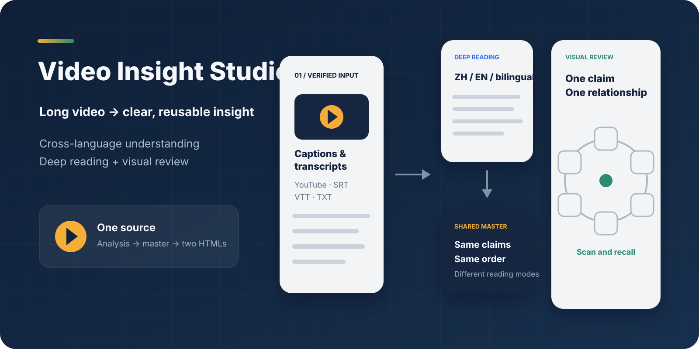
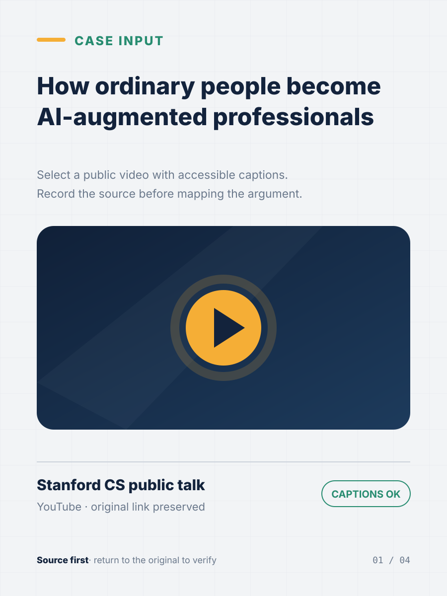
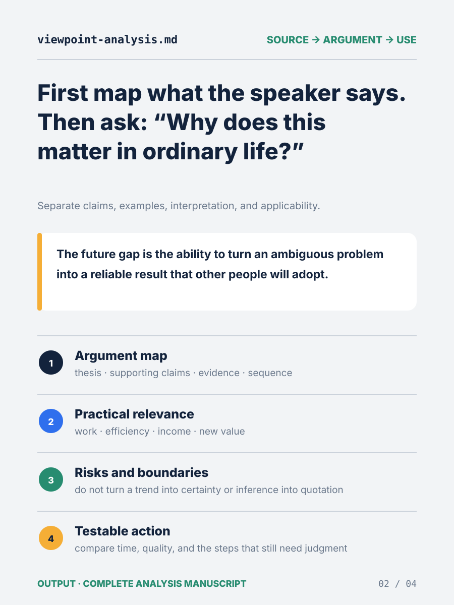
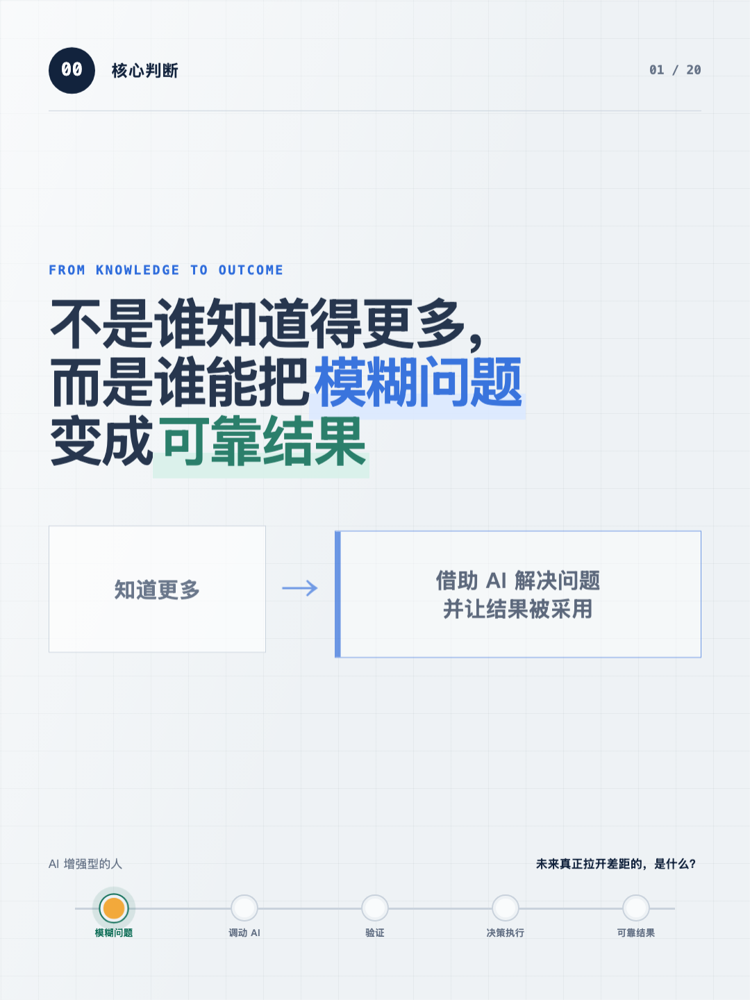
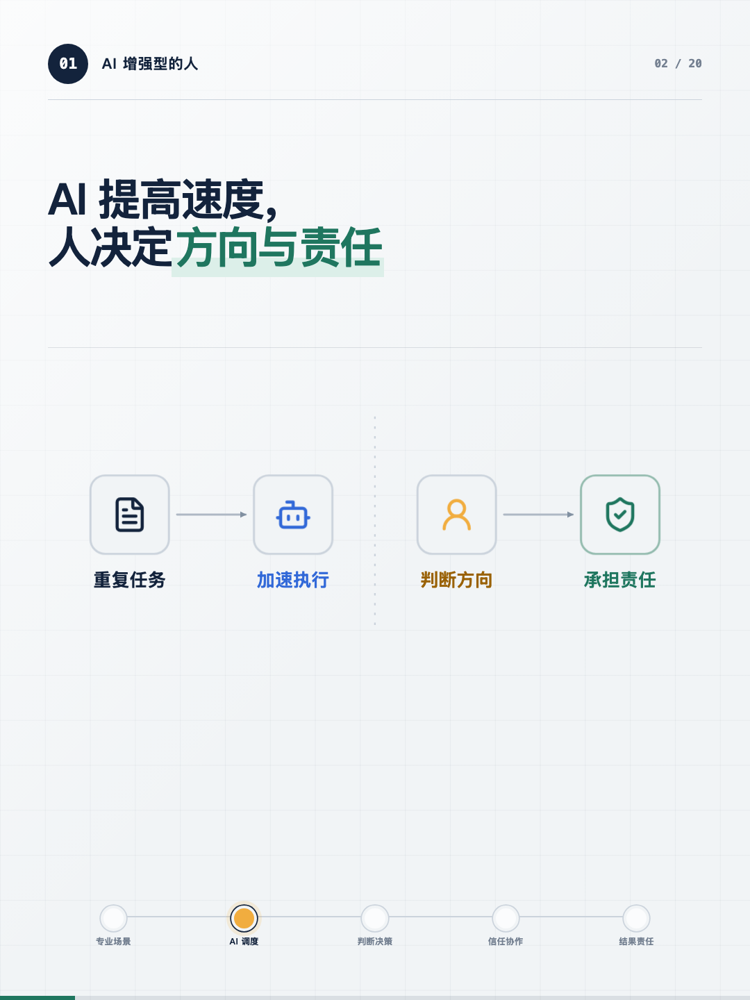

<div align="center">
  

# 视频观点工坊

**让不懂原视频语言、没时间看完长内容的人，也能快速了解重点并深入回顾。**

[English](README.md) · [在线演示](https://tuyaya194-png.github.io/video-insight-studio/) · [快速开始](#快速开始) · [示例](#示例) · [工作原理](#工作原理)
</div>

## 为什么需要它

外语和时长，是很多人理解优质视频的两道门槛：看不懂原语言，或没有时间完整观看，却仍然想知道它真正讲了什么。普通要点摘要虽然快，却经常丢掉论证过程、例子和适用边界。

视频观点工坊把它当作一条完整工作链：

```text
视频 / 链接 / 字幕 / 逐字稿
          ↓
论证梳理 + 普通人相关性分析
          ↓
统一内容母稿
          ↓
文字精读版 HTML  +  图形速览版 HTML
          ↓
结构校验与浏览器逐页验收
```

两版使用相同的核心观点和页序，但解决不同场景。

| 输出 | 使用场景 | 读者得到什么 |
| --- | --- | --- |
| 文字精读版 | 完整理解、保存、检索和反复查阅 | 完整解释、例子、边界和行动建议；可选中文、英文或中英双语 |
| 图形速览版 | 快速浏览、抓重点和隔一段时间回顾 | 每页一句核心观点和一个易懂关系图 |

## 明确支持哪些输入

为了避免安装后才发现目标内容无法处理，仓库只把经过验证的入口列为明确支持。

| 输入 | 状态 | 说明 |
| --- | --- | --- |
| 带有可访问字幕的 YouTube 公开视频 | 已验证 | 支持人工字幕和自动字幕；私密、地区限制或关闭字幕的视频不保证可用 |
| `.srt`、`.vtt`、`.txt` 字幕或逐字稿 | 已验证 | 最稳定的通用入口，不依赖视频平台 |
| 直接粘贴的访谈、播客或视频文字 | 已验证 | 可直接进入观点分析和双版 HTML 生成 |
| 本地视频或音频 | 条件支持 | 取决于当前环境是否具备可用的语音转写工具 |
| 其他平台链接 | 尽力处理，不作承诺 | 开始前先检查；无法读取时会立即请求字幕、逐字稿或本地文件 |

## 核心特点

- **忠于来源**：区分演讲者观点、演讲者例子和分析者解释。
- **对外语内容友好**：文字精读版可选择中文、英文或中英双语，降低语言门槛。
- **对长内容友好**：先用图形速览抓住结构，再按需要进入文字精读，不必盲目重看整段视频。
- **关注普通人真正能受益的部分**：把抽象趋势翻译为工作、学习、时间、收入、风险和明天可验证的下一步，同时标明哪些是基于原内容的应用性推导。
- **不止生成要点列表**：区分原作者观点、案例和分析性解释，并主动标出常见误解与适用边界。
- **一份母稿、两种输出**：避免精读版和速览版观点漂移。
- **固定视觉语法**：只使用流程、对比、汇聚、分层、闭环和分界等少量关系结构。
- **离线单文件 HTML**：可以长期保存、搜索和再次打开，不依赖临时本地服务，也不要求安装 PowerPoint。
- **内置校验**：检查页数、播放结构、外部依赖、视觉系统标记和预览状态。
- **本地优先**：内置脚本不会上传原始视频、字幕或生成文件。
- **尊重原作和版权**：保留来源链接，只生成分析、摘要和转述，不复制完整逐字稿或原视频素材。
- **先验可用性**：收到链接后先确认页面和字幕能否读取，失败时尽早说明，不让用户长时间等待后才发现无法处理。

## 快速开始

### 已经安装？只发一句话就能开始

```text
使用 $video-to-insight-html 处理这个视频：<视频链接>
```

不需要先理解所有选项。没有额外要求时，Skill 会自动：

- 使用当前对话语言生成文字精读版；
- 提炼核心观点，并分析对普通人的实际价值；
- 同时生成文字精读版和图形速览版；
- 开始前先检查视频和字幕能否读取。

如果有需要，可以再补充“中英双语”“重点关注职业选择”或“只生成文字精读版”。如果链接无法读取，Skill 会直接请你提供字幕、逐字稿或本地文件，不需要你自己排查平台限制。

### 使用 GitHub CLI 安装

```bash
gh skill install tuyaya194-png/video-insight-studio video-to-insight-html \
  --agent codex \
  --scope user
```

### 在 Codex 中安装

```text
$skill-installer install https://github.com/tuyaya194-png/video-insight-studio/tree/main/skills/video-to-insight-html
```

安装后重启 Codex，然后直接说：

```text
使用 $video-to-insight-html 处理这个视频：<视频链接>
```

需要自定义时再补充：

```text
使用 $video-to-insight-html 处理这个视频，采用中英双语，重点关注职业选择：<视频链接>
```

## 生成内容

```text
<主题>_视频观点双版HTML_<日期>/
├── 01_观点分析/观点分析.md
├── 02_文字精读版/index.html
├── 03_图形速览版/index.html
└── project.json
```

项目初始化、校验和双预览命令见 [英文 README 的 Quick start](README.md#quick-start)。

## 示例

仓库包含一套20页双版本示例，内容来自一场关于“AI 增强型的人”的公开演讲分析：

- [示例说明与来源](examples/ai-augmented-person/README.md)
- [观点分析文稿](examples/ai-augmented-person/analysis.zh-CN.md)
- [文字精读版 HTML](examples/ai-augmented-person/text-version/index.html)
- [图形速览版 HTML](examples/ai-augmented-person/presentation-version/index.html)

| 01 来源视频 | 02 观点分析 | 03 文字精读版 | 04 图形速览版 |
| --- | --- | --- | --- |
|  |  |  |  |

四张图展示同一份来源如何变成可核对的观点文稿，再从同一内容母稿生成两种 HTML。

## 工作原理


## 视觉原则

1. 先确定观点，再决定图形。
2. 精读版解释完整，速览版只负责澄清关系，两者服务不同的理解速度。
3. 所有连线必须在节点后方，不能切割图标、卡片和文字。
4. 闭环必须真正闭合，节点中心落在同一圆周上，圆线从图标背后经过。
5. AI 不能代替专业知识和来源核验。
6. 本地预览不等于公开发布，`127.0.0.1` 只在本地服务运行时可访问。

## 兼容性与限制

该 Skill 已针对 Codex 制作和测试，`SKILL.md` 遵循开放的 Agent Skills 格式。脚本只使用 Python 标准库。

- 分析质量依赖可靠字幕、逐字稿或源材料。
- 平台受限时，可能需要用户提供字幕或本地视频。
- 观点与视觉仍需人工复核事实和语境。
- 本项目用于分析和理解辅助，不替代原视频；公开分享或商业使用前，应自行确认引用、翻译和素材授权。
- 当前输出交互式 HTML，不直接导出最终 MP4。

## 参与和许可

提交问题或修改前请阅读 [CONTRIBUTING.md](CONTRIBUTING.md)。原创代码和文档采用 [MIT License](LICENSE)；内嵌 Lucide 图标路径的许可见 [THIRD_PARTY_NOTICES.md](THIRD_PARTY_NOTICES.md)。
